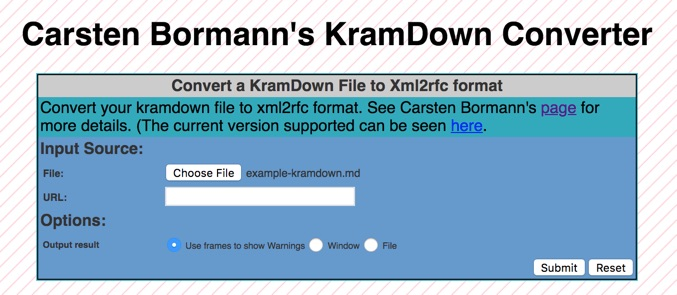

<!-- $theme: default -->
<!-- $size: 16:9 -->
<!-- Conversion to slides via Marp - https://github.com/yhatt/marp -->


# Writing Internet-Drafts in Markdown

## 
##
##

Dan York
york@isoc.org
@danyork

June 12, 2018  - IETF Hub Boston

---
<!-- page_number: true -->
<!-- footer: Writing Internet-Drafts in Markdown -->
# Why Markdown?

Because this...

```text
  --- middle

  # Introduction

  Here is some intro text.
```
is easier for _most_ people to understand than this...
```text
<middle>
    <section title="Introduction">
        <t>Here is some intro text.</t>
    </section>
</middle>
```

---
# What is Markdown?

- Lightweight text formatting language
- Developed by John Gruber in 2004 with help from Aaron Schwartz
- https://daringfireball.net/projects/markdown/
- Inspired by customs and conventions emerging out of text-based email

##

"_The overriding design goal for Markdown’s formatting syntax is to make it as readable as possible. The idea is that a Markdown-formatted document should be publishable as-is, as plain text, without looking like it’s been marked up with tags or formatting instructions._"

##

"_The idea for Markdown is to make it easy to read, write, and edit prose. HTML is a **publishing** format; Markdown is a **writing** format._"

---
# Markdown example

```text
# First level heading

Some text

## Second level heading

- first bullet with _italic text_
- second bullet with **bold text**
- third bullet

### Third level heading

Visit [the IETF's web site](https://www.ietf.org)

## Second level heading

(you get the idea...)
```
---
# Comparison of Markdown to other formats

[RFC 7764](https://tools.ietf.org/html/rfc7764) has this useful chart:
```text

     informal        /---------formatted text----------\        formal
     <------v-------------v-------------v-----------------------v---->
      plain text     informal markup   formal markup    binary format
                     (Markdown)        (HTML, XML, etc.)
```

---
# But what if you want to write something that is NOT in the original Markdown syntax?

(for example, tables...)

---
# Markdown and Standardization

##

"_I believe Markdown’s success is *due to*, not in spite of, its lack of standardization. And its success is not disputable._"

"_Because different sites (and people) have different needs. No one syntax would make all happy._"

- John Gruber, [twitter thread in 2014](https://twitter.com/gruber/status/507670720886091776)

---
# The many flavors of Markdown

- "Original" from John Gruber
- MultiMarkdown
- GitHub Flavored Markdown (GFM)
- pandoc
- kramdown
- Fountain
- CommonMark
    - An attempt at standardizing Markdown by a group of advocates
    - www.commonmark.org
- _**MANY**_ other variants...  _(including the one I used to create these slides)_

---
# The text/markdown media type and an IANA Registry

Informational **[RFC7763](https://tools.ietf.org/html/rfc7763)** (March 2016):
- registers the text/markdown media type 
- defines a "Markdown Variants" registry established by IANA
- registers "Original" in that new registry

IANA Registry at:
- https://www.iana.org/assignments/markdown-variants/markdown-variants.xhtml

---
# RFC 7764

- Informational RFC also in March 2016
- Title: "**Guidance on Markdown: Design Philosophies, Stability Strategies, and Select Registrations**"
- A good read to understand more about Markdown
- Registers with IANA:
    - a number of common Markdown variants, including:
        - kramdown-rfc2629
        - RFC7328 - Pandoc2rfc

---
# ENOUGH ALREADY... let's build some Internet Drafts!

---
# FYI... it's actually a 2-step process

At a basic level, the various tools do this:

## 1. Take a markdown file and generate "xml2rfc" XML
- Originally often called "RFC 2629 XML", but then later defined in RFC 7749 "xml2rfc v2" and now **[RFC 7991](https://tools.ietf.org/html/rfc7991)** "xml2rfc v3"

## 2. Run "xml2rfc" on the resulting XML to generate TXT

---
# First Step: Choosing your tool chain

- Kramdown-rfc
    - https://github.com/cabo/kramdown-rfc2629
    - Developed in Ruby by Carsten Bormann
    - Can be used online at: https://xml2rfc.tools.ietf.org/experimental.html

- mmark
    - https://github.com/miekg/mmark
    - Developed in Go by Miek Gieben
    - Supported by Docker image from Paul Jones: https://github.com/paulej/rfctools

---
# Other Markdown tool options

- pandoc
    - https://www.rfc-editor.org/rfc/rfc7328.txt
    - pandoc2rfc - http://github.com/miekg/pandoc2rfc - by Miek Gieben
    - Based on pandoc from John MacFarlane - http://pandoc.org/
    - Unable to generate XML2RFC v3 XML
    - Miek views mmark as the successor
- draftr
    - https://ipv.sx/draftr/
    - Quick visual tool from Richard Barnes that allows you to see the conversion
    - Currently based on an older version of kramdown-rfc

---
# Getting Started with kramdown-rfc (locally)

1. Assuming your computer has Ruby, install the `kramdown-rfc2629` package:
`gem install kramdown-rfc2629`

2. Create your file using your favorite text editor
    - Many "markdown editors" also available
    - Convention is to end file with `.md` or `.mkd`
3. Just execute the `kdrfc` command:
`$ kdrfc draft-whomever-some-witty-name.md`
4. Output is two files: `.xml` and `.txt`

### More info: https://github.com/cabo/kramdown-rfc2629

---
# Using kramdown-rfc remotely

1. Create your file using your favorite text editor
2. Visit https://xml2rfc.tools.ietf.org/experimental.html
3. Find the kramdown box:

4. Choose file and submit for processing
5. The XML file will be downloaded to your computer.
    - _NOTE:_ The XML file name is currently same name as input file, including `.md` extension.

---
# Kramdown-rfc Notes

- Based on kramdown parser by Thomas Leitner. Syntax:
    - https://kramdown.gettalong.org/syntax.html
- File starts with `---`
- Header based on YAML. Example
```text
title: Your amazing title
abbrev: Your Abbreviation
docname: draft-todo-your-name-here
ipr: trust200902
area: General
author:
    ins: C. Bormann
    name: Carsten Bormann
    email: cabo@tzi.org
```
- References:
    - Normative: `{{!RFC2119}}` or Informative: `{{?RFC1925}}`

---
# Getting Started with mmark

1. Ensure that the Go language is available.
2. (Follow instructions on https://github.com/miekg/mmark to build application.)
3. Use the `mmark` command to generate XML:
    `./mmark/mmark -xml2 -page draft-whomever-some-witty-name.md`
4. Use `xml2rfc` to generate TXT:
    `xml2rfc --text draft-whomever-some-witty-name.xml`
    
(Make files can automate this.)

### More info: https://github.com/miekg/mmark

---
# Automating mmark with a Docker image

- Paul Jones provides Docker image with both `mmark` and `xml2rfc`
    - https://github.com/paulej/rfctools
    - Docker Hub: https://hub.docker.com/r/paulej/rfctools/
- With Docker installed, just do:
`docker pull paulej/rfctools`
- Actual command is rather long:
`  $ docker run --rm --user=$(id -u):$(id -g) -v $(pwd):/rfc -v $HOME/.cache/xml2rfc:/var/cache/xml2rfc -w /rfc paulej/rfctools md2rfc draft-jones-markdown-example-00.md
`
- Sooo... just grab [Paul's sample Makefile](https://raw.githubusercontent.com/paulej/rfctools/master/example/Makefile) and reduce your command to:
`make`
	- _(assumes the file starts with 'draft-')_

---
# Mmark Notes

- Syntax draws from kramdown, pandoc and more. Defined:
    - https://miek.nl/2016/march/05/mmark-syntax-document/
- File starts with `%%%`
- Header based on TOML ( https://github.com/toml-lang/toml ):
```text
% title = "Your amazing title"
% abbrev = "Your abbreviation"
% docName = "draft-todo-your-name-here"
% ipr= "trust200902"
% [[author]]
% initials="R."
% surname="Gieben"
% fullname="R. (Miek) Gieben"
%   [author.address]
%   email = "miek@miek.nl"
```
- References:
    - Normative: `[@!RFC2119]` or Informative: `[@?RFC1925]`

---
# Finding examples to get started

- Easiest way to begin is to find other people's Markdown I-Ds
- Examples provided in Github repos of both kramdown-rfc and mmark

**For people wanting a deeper dive:**
- Martin Thomson provides a thorough git repo:
    - https://github.com/martinthomson/i-d-template
    - See features: https://github.com/martinthomson/i-d-template/blob/master/doc/FEATURES.md
    - Supports files in both kramdown-rfc and mmark formats

---
# My own examples

- Created using mmark via Docker image (primarily because at the time I was learning more about Docker and this gave me a reason to experiment)
- **draft-york-manycouches-completely-virtual-meetings**
    - https://github.com/danyork/draft-york-manycouches-completely-virtual-meetings
    - https://tools.ietf.org/html/draft-manycouches-completely-virtual-meetings-04

- **draft-york-dnsop-deploying-dnssec-crypto-algs**
    - https://github.com/danyork/draft-deploying-dnssec-crypto-algs
    - https://tools.ietf.org/html/draft-york-dnsop-deploying-dnssec-crypto-algs

---
# Resources

- RFC 7763 - https://tools.ietf.org/html/rfc7763
- RFC 7764 - https://tools.ietf.org/html/rfc7764
- Tutorial: **Writing RFCs and Internet-Drafts in markdown and a bit of YAML**
    - https://www.ietf.org/about/participate/tutorials/process/writing-rfcs-and-internet-drafts-markdown-and-bit-yaml/
    - Presented at IETF 92 in Dallas in 2015
    - Tools have evolved but still provides good foundation
---
# One other alternative
- asciirfc
    - Not Markdown, but a similar idea
    - https://tools.ietf.org/html/draft-ribose-asciirfc
    - https://github.com/riboseinc/rfc-asciirfc-minimal
    - Based on https://asciidoctor.org/
    - Provides a more formal, structured text markup

---
# Final Thoughts

- Markdown provides an easy way to rapidly create Internet Drafts without needing to know XML
- Markdown tools can be used to generate XML if you want to then work more in XML
    - Tools can only do Markdown -> XML
    - Some people who work in XML use Markdown as a way to bootstrap the creation of their XML files
- Markdown can be extended by embedding XML snippets (for example, if you want to use some feature in XML that is not yet in Markdown)
- The ecosystem of tools, apps, services, and sites that support Markdown continues to expand

---
# Getting more involved

### If you want to do more with writing Internet Drafts in Markdown, 
### you can join the **rfc-markdown** list:

### https://www.ietf.org/mailman/listinfo/Rfc-markdown

---
# Thank You

Dan York
york@isoc.org
@danyork

FYI, these slides were created in Markdown and rendered using MARP (https://yhatt.github.io/marp/)

Slides can be found at:
- https://github.com/danyork/writing-internet-drafts-in-markdown

